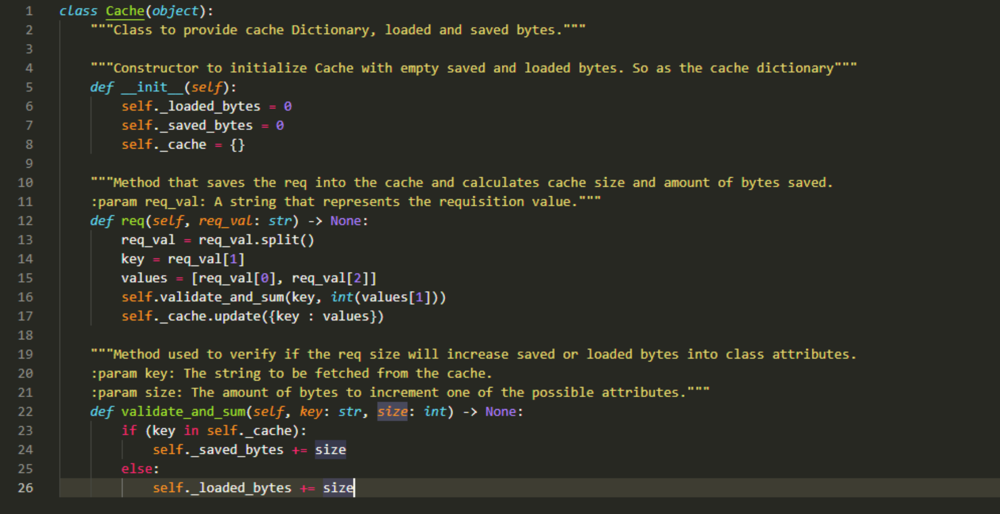

<h2>Fundação Universidade Federal do ABC</h2>

<h1>Relatório Projeto 3 - Simulação de um servidor Proxy</h1>

Nome: Guilherme Rodrigues				RA: 11201811447

Nome: Ian Lacerda da Silva				RA: 11115514

Nome: Leonardo Sugano Tomioka			RA: 21043514

Nome: Renan Ferreira Lima				RA: 11201722759

<h3>Nome do professor: Carlos da Silva dos Santos<h3>
<h3>Disciplina: Análise e Estrutura de Dados II</h3>

Quadrimestre: Q1.2021

Turno: Noturno

<h4 style="display:flex; justify-content: center;">Santo André<h4>
<h4 style="display:flex; justify-content: center;">maio/2021<h4>
  
<h2>Introdução</h2>
 

O intuito deste trabalho é simular o comportamento de um servidor de proxy para serviço de cache de internet. Para isso utilizou-se a linguagem de programação Python para o desenvolvimento do código-fonte e uma amostra de requisições de dados para a Wikipedia em português (pt.wikipedia.org) fornecida previamente.
A entrada possui três campos: instante (em segundos) que a requisição é feita, nome do recurso solicitado (página da web ou recurso do domínio) e tamanho do recurso (quantidade em bytes).  Com esses campos é possível preencher o cache (utilizando um dicionário), o qual é inicialmente nulo, a partir de então pode-se verificar, a cada nova requisição, se já há recursos na coleção local. Em caso positivo, o campo de instante é atualizado e, através do campo de tamanho, consegue-se determinar o quanto de bytes foi economizado. O sistema é incremental, ou seja, caso não haja um registro anterior, uma nova linha é inserida no cache.
No final de toda a simulação, temos calculado a quantidade de bytes que foi economizado.

<h2>Materiais e métodos</h2>

A versão do Python utilizada foi a 3.8.5 65-bit, foi criado um setup.py para o referenciamento das bibliotecas utilizadas no projeto. A partir desse módulo, é possível instalar o pacote e as dependências do projeto através do comando

<pre><code>pip3 install git+git://github.com/leosugano/AED2-projeto3</code></pre>

ou

<pre><code>pip install git+git://github.com/leosugano/AED2-projeto3</code></pre>

Feito isto, basta fazer download do projeto também via github, e executá-lo com:

<pre><code>python3 main.py</code></pre>

Como interface de desenvolvimento, foi escolhido o Visual Studio Code, por sua gratuidade prover fácil acesso, e sua modularidade permitir a instalação de vários componentes que servem de suporte para o desenvolvimento, como o módulo python da microsoft, que provê Linting, Debugging (multi-threaded, remote), Intellisense, Jupyter Notebooks, code formatting, refactoring, unit tests, e mais.

Já a nível de código e estruturas de dados para a simulação, foram utilizados apenas pacotes built-in do python, já que a estrutura de dados utilizada é o <b>dictionary</b> do python, que por baixo dos panos se trata de um hashmap implementado em C. O mesmo vale para os outros métodos utilizados, como o do pacote sys, <b>sys.getsizeof()</b>, utilizado para medir o tamanho da estrutura de dados, e também o módulo path, utilizado para localização do arquivo de dados utilizado na simulação dentro do sistema operacional.

Fora as funções built-in, foi criado uma classe que comporta o cache, chamada Justamente Cache, conforme imagem abaixo:

  
