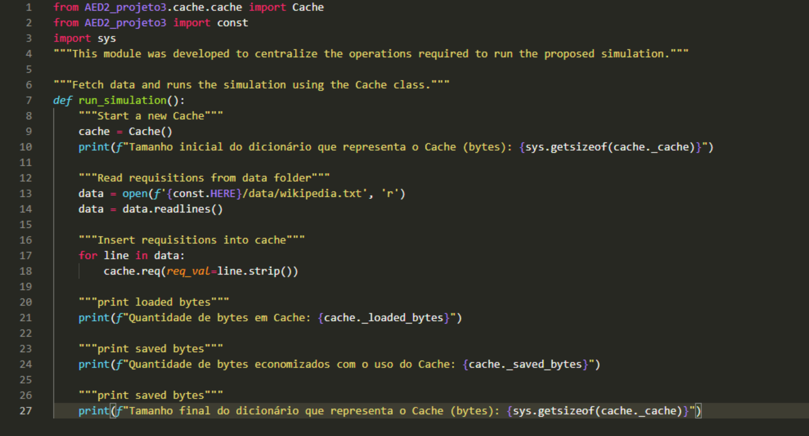
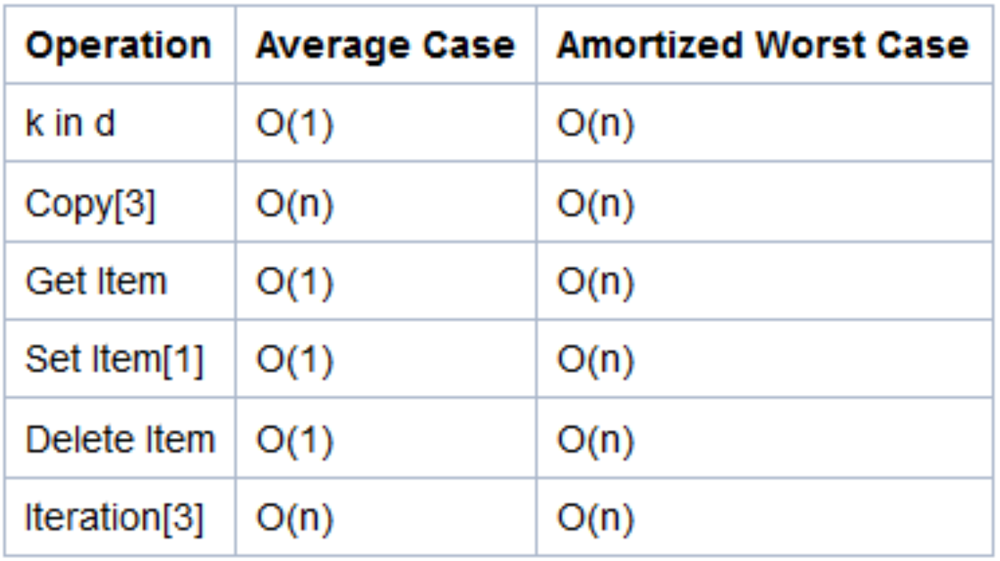
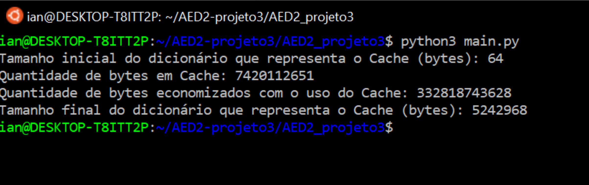
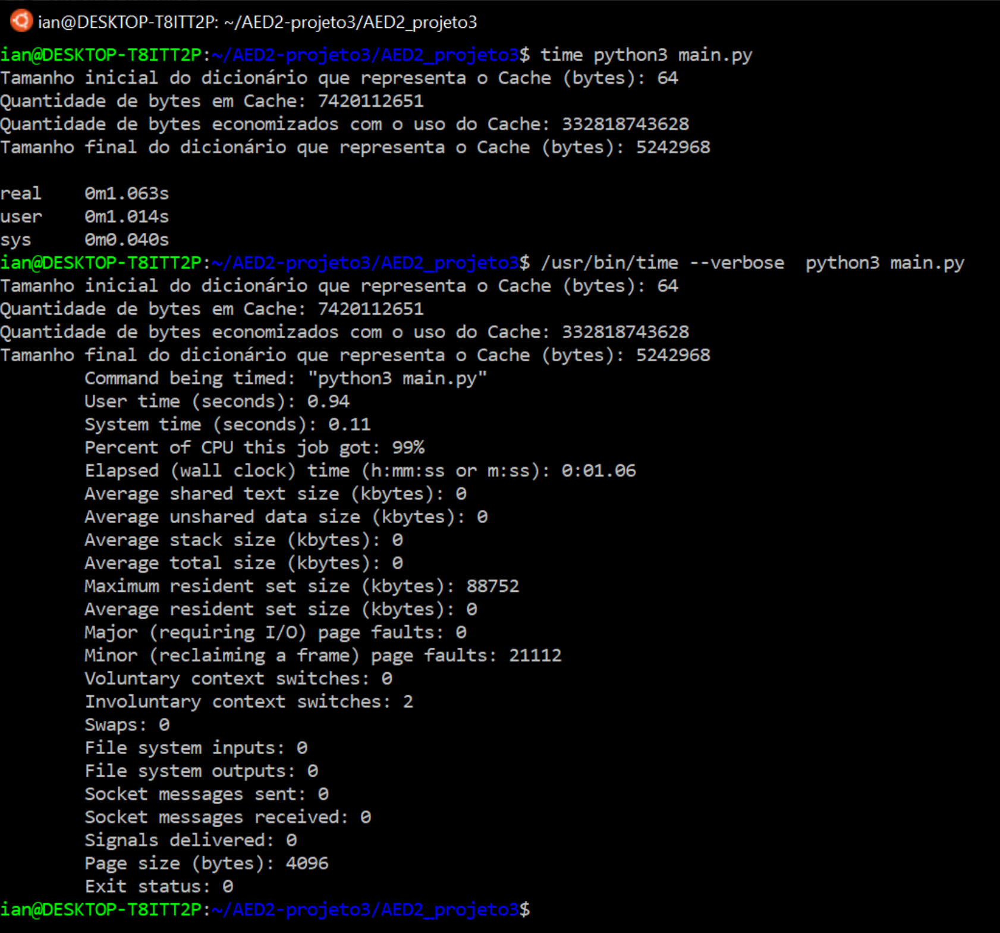

<h2>Fundação Universidade Federal do ABC</h2>

<h1>Relatório Projeto 3 - Simulação de um servidor Proxy</h1>

Nome: Guilherme Rodrigues				RA: 11201811447

Nome: Ian Lacerda da Silva				RA: 11115514

Nome: Leonardo Sugano Tomioka			RA: 21043514

Nome: Renan Ferreira Lima				RA: 11201722759

<h3>Nome do professor: Carlos da Silva dos Santos<h3>
<h3>Disciplina: Análise e Estrutura de Dados II</h3>

Quadrimestre: Q1.2021

Turno: Noturno

<h4 style="display:flex; justify-content: center;">Santo André<h4>
<h4 style="display:flex; justify-content: center;">maio/2021<h4>
  
<h2>Introdução</h2>
 

O intuito deste trabalho é simular o comportamento de um servidor de proxy para serviço de cache de internet. Para isso utilizou-se a linguagem de programação Python para o desenvolvimento do código-fonte e uma amostra de requisições de dados para a Wikipedia em português (pt.wikipedia.org) fornecida previamente.
A entrada possui três campos: instante (em segundos) que a requisição é feita, nome do recurso solicitado (página da web ou recurso do domínio) e tamanho do recurso (quantidade em bytes).  Com esses campos é possível preencher o cache (utilizando um dicionário), o qual é inicialmente nulo, a partir de então pode-se verificar, a cada nova requisição, se já há recursos na coleção local. Em caso positivo, o campo de instante é atualizado e, através do campo de tamanho, consegue-se determinar o quanto de bytes foi economizado. O sistema é incremental, ou seja, caso não haja um registro anterior, uma nova linha é inserida no cache.
No final de toda a simulação, temos calculado a quantidade de bytes que foi economizado.

<h2>Materiais e métodos</h2>

A versão do Python utilizada foi a 3.8.5 65-bit, foi criado um setup.py para o referenciamento das bibliotecas utilizadas no projeto. A partir desse módulo, é possível instalar o pacote e as dependências do projeto através do comando

<pre><code>pip3 install git+git://github.com/leosugano/AED2-projeto3</code></pre>

ou

<pre><code>pip install git+git://github.com/leosugano/AED2-projeto3</code></pre>

Feito isto, basta fazer download do projeto também via github, e executá-lo com:

<pre><code>python3 main.py</code></pre>

Como interface de desenvolvimento, foi escolhido o Visual Studio Code, por sua gratuidade prover fácil acesso, e sua modularidade permitir a instalação de vários componentes que servem de suporte para o desenvolvimento, como o módulo python da microsoft, que provê Linting, Debugging (multi-threaded, remote), Intellisense, Jupyter Notebooks, code formatting, refactoring, unit tests, e mais.

Já a nível de código e estruturas de dados para a simulação, foram utilizados apenas pacotes built-in do python, já que a estrutura de dados utilizada é o <b>dictionary</b> do python, que por baixo dos panos se trata de um hashmap implementado em C. O mesmo vale para os outros métodos utilizados, como o do pacote sys, <b>sys.getsizeof()</b>, utilizado para medir o tamanho da estrutura de dados, e também o módulo path, utilizado para localização do arquivo de dados utilizado na simulação dentro do sistema operacional.

Fora as funções built-in, foi criado uma classe que comporta o cache, chamada Justamente Cache, conforme imagem abaixo:

A ideia desta classe é prover os atributos solicitados para a simulação, que é o cache em si, no caso o <b>dict</b> referenciado por <b>_cache</b>.

A quantidade de bytes (simulados) carregados no cache e a quantidade de bytes (simulados) economizadas com o uso desse cache. Esses valores são referenciados, respectivamente, por <b>_loaded_bytes</b> e <b>_saved_bytes</b>.

A classe também conta com métodos para preenchimento desses valores, conforme documentação no código.

Além da classe Cache, foi desenvolvido um módulo responsável por organizar as operações necessárias para simular a entrada de dados no Cache em questão. Confira abaixo:

Com um pouco mais de profundidade, basicamente é instanciada um objeto Cache, e a partir da fonte de dados disponibilizada na especificação do projeto, os valores de requisição são processados, e ao final do processamento, são exibidos os valores questionados pelo professor ao definir o escopo do trabalho.

Fora estes módulos, o projeto completo ainda conta com outros três módulos, <b>setup.py</b>, que como dito anteriormente é responsável pela organização dos módulos formando o escopo do projeto. E também o <b>const.py</b>, que salva alguns dados de path para utilização dos dados e também instalação do pacote. Por fim, o <b>main.py</b>, apenas utilizado como entry point, chamando o método desenvolvido em simulation.py.

Por fim, descendo ao nível de justificativas e complexidade da estrutura de dados, o ponto mais importante para a escolha do python dict é simplicidade, já que é muito fácil utilizá-lo, e também sua notoriedade, já que é muito empregado em projetos de data science. A sua complexidade que também é um ponto de discussão na hora de escolher uma estrutura de dados, também se mostra excelente ao observarmos o caso geral de uso disposto na documentação do python, encontrada em <a href="https://wiki.python.org/moin/TimeComplexity">https://wiki.python.org/moin/TimeComplexity</a>, já que apenas a cópia e iteração do dict têm notação O(n), com todas as outras operações sendo constantes (O(1)).

Quanto ao tamanho final que a estrutura atingiu, foram <b>5242968 bytes</b>, aproximadamente 5,2 MB. Como não foi possível realizar a simulação com outra linguagem/Estrutura de dados, um ponto de evolução para o projeto seria justamente realizar a comparação de relatórios com outros grupos da turma.

<h2>Resultados</h2>

O tamanho inicial do dicionário que representa o cache tinha <b>64 bytes</b>, o tamanho final do cache foi de <b>7420112651 bytes</b> (simulados) e o total economizado foi de <b>332818743628 bytes</b> (simulados). A estrutura de dados, após o processamento de todas as requisições (linhas do .txt disponibilizado) foi aproximadamente 5,2 MB, como pode ser visto na figura abaixo:

Para a confecção dos resultados, o sistema operacional utilizado foi o Ubuntu 20.04 LTS e o Python versão 3.8.5 que vem associada a essa versão do sistema operacional durante as últimas semanas do mês de abril de 2021. O teste do relatório não foi possível ser executado em versões inferiores do Python, como a versão 3.7.3 no Sistema Operacional Debian 9.

Utilizando o comando <code>time python3 main.py</code> no shell do Ubuntu 20.04 LTS para calcular o tempo de execução do script em um computador com 8 núcleos a 4.0 GHz, obtivemos um tempo de uso de processamento da CPU de 1.063s. Já ao utilizarmos o comando  <code>/usr/bin/time --verbose  python3 main.py</code> para obtermos mais informações sobre o programa, vimos que o programa utilizou um pico de 88752000 bytes para executar o script Python. Como pode ser visto na imagem abaixo:

O programa utiliza, assim, mais acesso ao disco rígido - SSD ou HD - do que a memória em si para fazer os cálculos do cache. Vale ressaltar também que o tempo de execução pode variar de acordo com o sistema utilizado para rodar o programa.

  
